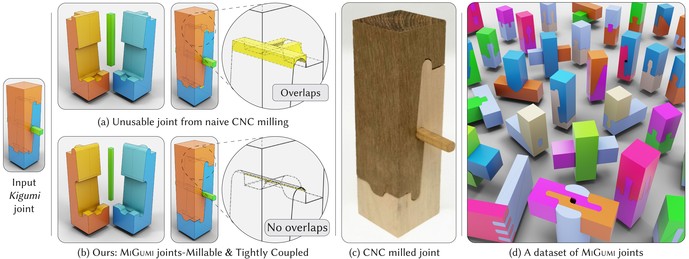

# MiGumi

<p align="center">
  
</p>

**MiGumi** (Millable Gumi) is a library for creating and visualizing tightly coupled integral joints that are manufacturable via CNC milling. This repository contains the code accompanying the paper [MiGumi: Making Tightly Coupled Integral Joints Millable](https://bardofcodes.github.io/migumi/).

## Overview

MiGumi provides:

- **Symbolic Geometry Representation**: Define millable joints using symbolic expressions with support for polyarcs, height fields, and stateful geometry
- **State-Based Animation**: Create assembly/disassembly animations showing how joint components fit together
- **Shader Compilation**: Compile geometry expressions to GLSL shaders for real-time visualization
- **Multi-pass Rendering**: Generate multi-buffer shader pipelines for advanced rendering effects

> **Note**: The current version supports the node-based visual editor. Optimization routines for joint design are still being integrated.

## Installation

```bash
# Clone the repository
git clone https://github.com/BardOfCodes/migumi.git
cd migumi

# Install in development mode
pip install -e .
```

### Dependencies

MiGumi requires the following companion libraries:

```bash
# GeoLiPI - Geometric Language for Procedural Images
pip install -e path/to/geolipi

# SySL - Shader Symbolic Language  
pip install -e path/to/sysl

# ASMBLR - Node assembly system
pip install -e path/to/asmblr
```

## Project Structure

```
migumi/
├── migumi/
│   ├── symbolic/           # Symbolic geometry representations
│   │   └── base.py         # Core classes (RegisterGeometry, RegisterState, etc.)
│   ├── shader/             # Shader compilation
│   │   ├── compiler.py     # Single-pass shader compilation
│   │   ├── compile_multipass.py  # Multi-buffer rendering
│   │   ├── transition_evaluate.py  # State transition code generation
│   │   └── state_based_converter.py  # State-to-motion conversion
│   ├── torch_compute/      # PyTorch-based computation
│   │   ├── evaluate.py     # Expression evaluation
│   │   ├── optimize.py     # Optimization routines
│   │   └── polyline_utils.py  # Polyline geometry utilities
│   └── utils/              # Utility functions
│       ├── converter.py    # Format conversion utilities
│       └── vis.py          # Visualization helpers
├── notebooks/              # Example notebooks
│   ├── test_basic.ipynb    # Basic usage examples
│   └── visualize.ipynb     # Visualization examples
└── assets/                 # Images and media
```

## Quick Start

```python
import json
from asmblr.base import BaseNode
from migumi.utils.converter import fix_format, get_expr_and_state, fix_expr_dict
from migumi.shader.compile_multipass import compile_set_multipass

# Load a joint design
with open("path/to/joint.json") as f:
    data = json.load(f)

# Parse the design
module_data = data['moduleList']['migumi']
corrected_data = fix_format(module_data)
expressions = BaseNode.from_dict(corrected_data)

# Extract geometry and state information
if not isinstance(expressions, list):
    expressions = [expressions]
expr_dict, state_map = get_expr_and_state(expressions)
expr_dict = fix_expr_dict(expr_dict, mode="v4", add_bounding=False)

# Compile to shaders
settings = {
    "render_mode": "v4",
    "variables": {
        "resolution": (512, 512),
    }
}
shader_bundles = compile_set_multipass(
    expr_dict, 
    state_map, 
    settings=settings,
    post_process_shader=["part_outline_nobg"]
)
```

## Visual Editor

MiGumi integrates with the [ASMBLR Frontend](../app/asmblr_frontend/) for visual editing:

1. Start the backend: `python asmblr_backend/scripts/app.py`
2. Start the frontend: `cd asmblr_frontend && yarn dev`
3. Select "Migumi" mode in the editor
4. Load pre-built designs from [migumi-dataset](https://huggingface.co/datasets/bardofcodes/migumi-dataset)

## Related Projects

- [GeoLiPI](https://github.com/bardofcodes/geolipi) - Geometric Language for Procedural Images
- [SySL](../sysl/) - Shader Symbolic Language
- [ASMBLR](https://github.com/bardofcodes/asmblr) - Node-based assembly system

## Citation

If you use MiGumi in your research, please cite:

```bibtex
@article{ganeshan2025migumi,
    author={Ganeshan, Aditya and Fleischer, Kurt and Jakob, Wenzel 
            and Shamir, Ariel and Ritchie, Daniel and Igarashi, Takeo 
            and Larsson, Maria},
    title={MiGumi: Making Tightly Coupled Integral Joints Millable},
    year={2025},
    publisher={Association for Computing Machinery},
    volume={44},
    number={6},
    url={https://doi.org/10.1145/3763304},
    doi={10.1145/3763304},
    journal={ACM Trans. Graph.},
    articleno={193},
}
```
## Acknowledgement:

The shader for PolyArc2D is based on:

1. https://www.shadertoy.com/view/3t33WH 

2. https://www.shadertoy.com/view/wl23RK

3. https://www.shadertoy.com/view/wdBXRW

4. Bulge parameterization from: https://github.com/jbuckmccready/cavalier_contours 

## License

MIT

---

⚠️ **Research Code**: This is research software accompanying an academic publication. Use at your own risk.
